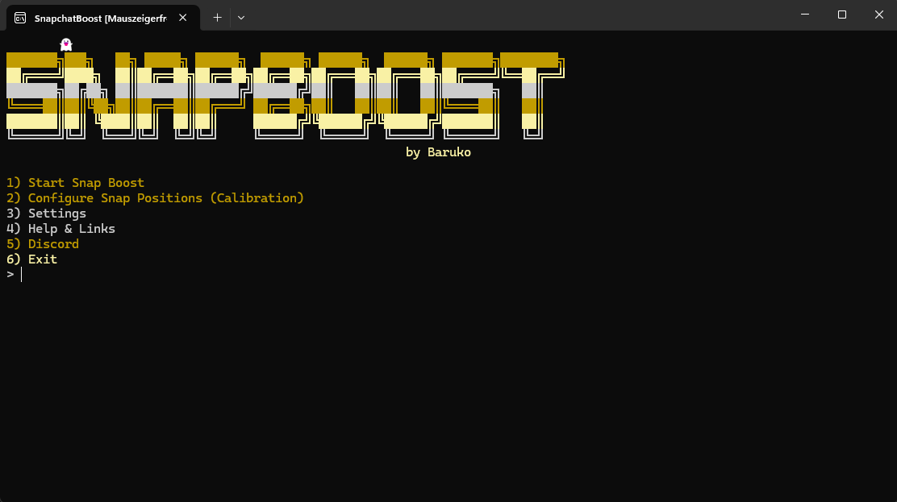

<div align="center">


# SnapchatBooster

**Erhöhe deinen Snapchat-Score automatisch – ohne Mauszeiger-Hijacking.**


</div>

---

## 📸 Preview



---

## ⚡ Features

- ✅ **Mauszeigerfreie Automatisierung** – dein Cursor bleibt komplett frei
- ✅ **Selenium-Browsersteuerung** – läuft im echten Chrome-Fenster
- ✅ **Einfache Kalibrierung** – einmalig 4 Klicks, danach vollautomatisch
- ✅ **Anpassbare Delays** – Speed nach Wunsch einstellen
- ✅ **ESC-Stopp** – jederzeit sicher beenden
- ✅ **Open Source** – 100% transparent

---

## 🚀 Installation

### Schritt 1 – Herunterladen & Entpacken

Lade das ZIP-Paket herunter und entpacke es in einen beliebigen Ordner.

### Schritt 2 – Abhängigkeiten installieren

```
install.bat
```

Doppelklick auf `install.bat`. Das Skript installiert automatisch alle benötigten Python-Bibliotheken (`selenium`, `keyboard`, `colorama`).

> ⚠️ **Voraussetzung:** Python 3.x muss installiert sein. Download: [python.org](https://www.python.org/downloads/)

### Schritt 3 – Bot starten

```
start.bat
```

Doppelklick auf `start.bat`. Es öffnet sich ein Chrome-Fenster und eine Konsole.

---

## 🎮 Verwendung

### Login
Logge dich im geöffneten Chrome-Fenster bei **[web.snapchat.com](https://web.snapchat.com)** ein. Sobald du das Kamera-Symbol siehst, drücke **ENTER** in der Konsole.

### Kalibrierung (einmalig)

Wähle **Option 2** im Menü und klicke nacheinander auf:

| Schritt | Klick-Ziel |
|---------|-----------|
| 1️⃣ | **Kamera-Button** (Foto aufnehmen) |
| 2️⃣ | **Senden-Button** (Send To) |
| 3️⃣ | **Shortcut-Emoji** (deine Verknüpfung) |
| 4️⃣ | **Alle auswählen** (Select All Checkbox) |

Die Koordinaten werden automatisch in `settings.json` gespeichert.

### Boost starten

Wähle **Option 1** – der Bot läuft nun im Hintergrund und boosted deinen Score. Mit **ESC** kannst du ihn jederzeit stoppen.

---

## ⚙️ Einstellungen (`settings.json`)

| Schlüssel | Standard | Beschreibung |
|-----------|----------|--------------|
| `loop_delay` | `0.2` | Pause zwischen Boost-Runden (Sekunden) |
| `click_delay` | `0.29` | Pause zwischen Klicks (Sekunden) |
| `shortcut_count` | `100` | Anzahl der Empfänger im Shortcut |

---

## 📂 Dateistruktur

```
SnapchatBooster/
├── main.py            ← Haupt-Bot-Skript
├── install.bat        ← Installer
├── start.bat          ← Starter
├── settings.json      ← Konfiguration
├── requirements.txt   ← Python-Abhängigkeiten
├── readme.md          ← Diese Datei
├── version.txt        ← Versionsnummer
└── snapscore_100k.png ← Score-Bild
```

---

## ❓ FAQ

**Funktioniert der Bot im Hintergrund?**
Ja – der Mauszeiger wird nicht bewegt. Du kannst normal weiterarbeiten.

**Wie viele Snaps werden pro Runde gesendet?**
So viele, wie Empfänger in deinem Shortcut sind (`shortcut_count` in `settings.json`).

**Chrome öffnet sich nicht?**
Stelle sicher, dass Google Chrome installiert und aktuell ist. Selenium lädt den passenden ChromeDriver automatisch.

**Bot sendet nicht richtig?**
Kalibriere erneut (Option 2). Snapchat Web kann sich nach Updates optisch verschieben.

---

## 🔗 Links

- **Discord:** [discord.com/invite/baruko](https://discord.com/invite/baruko)
- **GitHub:** [github.com/BarukoTropical/snapbooster](https://github.com/BarukoTropical/snapbooster)
- **Website:** [snap.studio-paradox.de](https://snap.studio-paradox.de)

---

<div align="center">
Erstellt für Bildungszwecke. Nutze das Tool verantwortungsbewusst.
</div>
